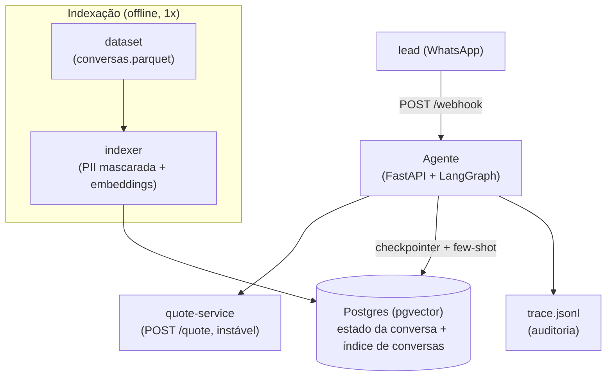
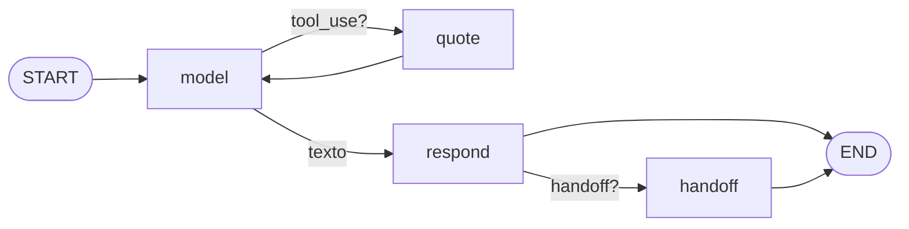
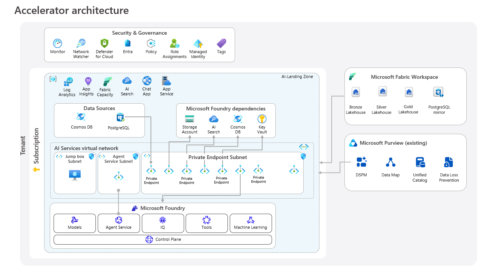

# AutoSeguro — Agente de Vendas (Desafio FDE)

Agente de vendas para uma seguradora de carros, que atende um lead de ponta a ponta: **conversa → qualifica → cota → decide** (resolve sozinho ou passa pra um humano).

> O enunciado original do desafio está em [DESAFIO.md](DESAFIO.md).

O que a solução entrega:

- **Orquestração com LangGraph** (grafo de estados explícito) + **Gemini** (via LangChain).
- **Cliente resiliente da `/quote`**: timeout curto, retry com backoff só em falha transitória, e **nunca fabrica preço** — falha vira handoff.
- **Handoff explícito**, com gatilhos enumerados em código.
- **Rastreabilidade** por trace JSONL (uma linha por mensagem/cotação/handoff, com status e latência).
- **PII mascarada** antes de qualquer log — e antes de indexar o dataset.
- **Memória durável** da conversa no Postgres (checkpointer do LangGraph).
- **Few-shot** com as conversas que converteram, via busca vetorial (pgvector).
- **Sobe tudo com Docker**.

---

## Como rodar (Docker)

Pré-requisitos: Docker e uma **chave do Google AI Studio (Gemini)**

**Gerando a chave (grátis, uma vez):**

1. Acesse [aistudio.google.com/apikey](https://aistudio.google.com/apikey) e entre com uma conta Google.
2. Clique em **Create API key** e copie a chave.
3. Não precisa de cartão nem billing — o tier gratuito do Gemini cobre esta demo.

```bash
# 1. chave na raiz (o docker-compose le este .env sozinho)
cp .env.example .env        # e cole a sua GOOGLE_API_KEY

# 2. sobe quote-api (instavel de proposito) + postgres + agent
docker compose up -d

# 3. indexa o historico no pgvector -> habilita o few-shot (1x, ~1min; idempotente)
docker compose --profile index run --rm indexer

# 4. conversa com o agente
curl -s -X POST localhost:8080/webhook -H 'content-type: application/json' \
  -d '{"conversation_id":"c1","message":"oi, quero seguro pro meu Corolla 2022, tenho 35 anos, cep 01310-100"}'
```

Resposta: `{ "conversation_id": "c1", "reply": "...", "handed_off": false }`. O
`conversation_id` mantém a conversa (estado no Postgres) — mande várias mensagens
com o mesmo id pra qualificar, escolher plano e cotar.

O passo 3 é executado uma vez (o índice fica no volume do Postgres e sobrevive a
restarts; rodar de novo apenas confirma e pula). Se você pular esse passo, o agente
**funciona igual** — só sem os exemplos de few-shot.

Pra **forçar** a reconstrução do índice (ex.: mudou o dataset), passe `-e REINDEX=1`
**antes** do nome do serviço:

```bash
docker compose --profile index run --rm -e REINDEX=1 indexer
```

**Testar os cenários:** o [TESTES.md](TESTES.md) traz um roteiro com `curl` pronto pra
cada caso — cotação OK, `/quote` fora do ar, cotação recusada, lead pedindo humano e
fora de escopo — além de como forçar o comportamento da `/quote` e ler os logs.

**Trace da execução:** cada passo é gravado em `agent/logs/trace.jsonl` (ver
[Rastreabilidade](#rastreabilidade) e [Log de execução](#log-de-execução)).

## Arquitetura



**O grafo do agente** ([agent/app/agent.py](agent/app/agent.py)):



- **model** — chama o Gemini com a tool `cotar`; injeta few-shot no system prompt.
- **quote** — executa o cliente resiliente da `/quote`, registra o trace e detecta handoff.
- **respond** — extrai a resposta, decide se houve handoff.
- **handoff** — `interrupt()` do LangGraph (human-in-the-loop): pausa pra um humano assumir.

Módulos (em `agent/app/`):

| Arquivo | Papel |
|---|---|
| `quote_client.py` | Cliente resiliente da `/quote` (retry/timeout, nunca inventa preço) |
| `handoff.py` | Política de handoff (gatilhos enumerados) |
| `tracing.py` | Trace estruturado JSONL (PII mascarada) |
| `pii.py` | Masking de CPF/e-mail/telefone/placa; extração de CEP |
| `tools.py` | Schema da tool `cotar` + system prompt |
| `agent.py` | Grafo LangGraph + few-shot |
| `retrieval.py` | Busca vetorial (pgvector) das conversas do histórico |
| `main.py` | Webhook FastAPI (`/webhook`, `/health`) |

---

## Decisões (e por quê)

### Resiliência da `/quote` — o ponto central
Em [quote_client.py](agent/app/quote_client.py), a regra de ouro é **nunca inventar
um preço**. A política:

- **Timeout curto por tentativa** (5s, configurável). A `/quote` lenta dorme 8s de
  propósito — cortamos antes disso e tentamos de novo, em vez de travar o lead.
- **Retry com backoff exponencial + jitter, só em falha transitória** (timeout, erro
  de conexão, 5xx).
- **422 (cotação recusada) e 400 (payload inválido) NÃO são retry** — são respostas
  determinísticas de negócio. Retry só gastaria tempo. São tratadas diferente dos 5xx.
- **Esgotou as tentativas → `INDISPONIVEL`**, que o agente traduz em handoff pro humano,
  com transparência ao lead. Nunca um preço fabricado.
- Cada tentativa (status, latência, nº de retries) vai pro trace.

### Handoff explícito e defensável
Em [handoff.py](agent/app/handoff.py), os gatilhos são **enumerados em código**, não
escondidos no LLM:

| Gatilho | Quando | Como é detectado |
|---|---|---|
| `api_indisponivel` | `/quote` falhou após os retries | `handoff.from_quote` (código) |
| `cotacao_recusada` | 422 (idade > 75, veículo > 20 anos) — fora da alçada do bot | `handoff.from_quote` (código) |
| `lead_pediu_humano` | lead pediu explicitamente | `handoff.from_text` — marcador `[HANDOFF:humano]` |
| `fora_de_escopo` | assunto que não é cotação de seguro auto | `handoff.from_text` — marcador `[HANDOFF:escopo]` |
| `erro_interno` | falha inesperada (ex.: modelo fora do ar / cota estourada) | `except` na borda do webhook ([main.py](agent/app/main.py)) |

Os dois primeiros são **determinísticos** (`from_quote`, a partir do resultado da
cotação); o terceiro e o quarto o agente **sinaliza** com um marcador no fim da
mensagem, mapeado por `from_text` (o marcador é removido antes de chegar ao lead, via
`strip_markers`, e o determinístico tem precedência). O último é uma **rede de
segurança**: qualquer exceção não tratada no `/webhook` é logada (com stacktrace),
registrada no trace e vira uma transferência com mensagem amigável — o canal nunca
recebe um `500`, e nunca inventamos nada.

### Rastreabilidade
[tracing.py](agent/app/tracing.py) grava um JSONL append-only (`agent/logs/trace.jsonl`),
uma linha por evento (`message` / `quote` / `handoff`) com `conversation_id`, status,
latência e nº de retries. `tail -f trace.jsonl | jq` reconstrói o atendimento inteiro.
Toda PII é mascarada antes de escrever.

### PII
[pii.py](agent/app/pii.py) redige CPF, e-mail, telefone e placa por regex **antes** de
qualquer coisa ir pro log. As mesmas regex extraem o CEP (input legítimo da cotação).
A mesma máscara roda também na indexação do dataset — nada sensível entra no índice.

### Framework e modelo
- **LangGraph** pra orquestração: grafo de estados explícito, **checkpointer durável**
  (estado por `conversation_id`) e `interrupt()` nativo pro handoff (human-in-the-loop).
  O modelo entra por `bind_tools` do LangChain — LangGraph cuida do fluxo/estado; o
  modelo, da extração/decisão; a chamada da `/quote`, do nosso código.
- **Gemini Flash** (`gemini-2.5-flash`) no loop de chat: no **tier gratuito** do Google
  AI Studio — roda sem barreira de billing. Acerta em avisar o
  lead com transparência quando a `/quote` cai. `temperature=0` pra respostas estáveis.
  Trocável por outro modelo/provider via `AGENT_MODEL` + o chat model do LangChain,
  sem mexer no grafo.
  > O free tier tem **limite de requisições por dia por modelo**. Se esbarrar
  > (HTTP 429), espere o reset (meia-noite PT) ou troque o `AGENT_MODEL` (ex.:
  > `gemini-2.5-flash-lite`, mais cota — porém mais fraco nos casos de borda).

### Memória durável
Checkpointer do LangGraph em **Postgres** (`PostgresSaver`). O estado do grafo é
guardado como dicts JSON-serializáveis, então a conversa sobrevive a restart.

### Few-shot (RAG)
[agent.py](agent/app/agent.py) injeta no system prompt as conversas passadas que
**converteram** (`outcome='ganho'`) mais parecidas com a fala do lead, buscadas por
similaridade no **pgvector** (mesmo Postgres). Embedding local via `fastembed` (CPU).

**Ressalva:** no dataset, temos os preços sem ter a confirmação de que foram consultados da
API. Usar isso cru como "bom exemplo" ensinaria o agente a fabricar preço. Por isso o few-shot: (1) filtra só `ganho`,
(2) **remove os preços** dos exemplos, (3) instrui explicitamente *"aprenda o tom/objeção,
NUNCA cite preço — sempre cote pela tool"*. É few-shot de **estilo**, não de comportamento
de cotação. Desligável com `FEWSHOT_ENABLED=0`.

### Local-first
A resolução roda **100% local** (Docker). Cheguei a desenhar o caminho de produção
na Azure, mas o mantive fora do código pra não pesar a legibilidade (IaC/nuvem não
eram requisito). Ver [Próximos passos](#próximos-passos-produção).

---

## Como a solução atende os critérios

| Critério (do enunciado) | Onde |
|---|---|
| Funciona de ponta a ponta | `docker compose up` + `POST /webhook`; grafo conversa→cota→decide |
| **O que faz quando a `/quote` falha** | `quote_client.py`: retry/backoff em 5xx/timeout, nunca inventa preço, esgotou → handoff |
| Handoff explícito e defensável | `handoff.py`: gatilhos enumerados |
| Dá pra rastrear | `tracing.py`: JSONL por mensagem/cotação/handoff, com id e status |
| Cuidado com PII | `pii.py`: masking antes de logar e de indexar |
| Qualidade / legibilidade | módulos coesos, um caminho só, decisões documentadas aqui |

---

## Avaliação em cima do dataset

[eval/run_eval.py](agent/eval/run_eval.py) usa o mesmo índice (do passo 3 de
[Como rodar](#como-rodar-docker)) pra responder *"quando o lead reclamou de X, o que
costumou acontecer?"* — agregando o desfecho das conversas mais parecidas com cada
objeção. Serve de insumo pro few-shot e pra entender padrões de objeção.

```bash
cd agent && uv run python -m eval.run_eval
```

> Nota: como as conversas são sintéticas e o desfecho é atribuído
> proceduralmente (não causal), o valor analítico é limitado — o uso principal do
> dataset aqui é o few-shot de tom/objeção.

---

## Log de execução

Cada execução grava `agent/logs/trace.jsonl`. Formato (uma linha por evento):

```jsonl
{"type":"message","conversation_id":"c1","role":"lead","text":"quero seguro, tenho 35 anos, cpf ***.***.***-**","ts":"..."}
{"type":"quote","conversation_id":"c1","request":{"plano_id":"completo","idade":35,"veiculo_ano":2022,"cep":"01310-100"},"outcome":"ok","retries":2,"premio_mensal":209.9,"attempts":[{"n":1,"status":503,"latency_ms":40,"error":"upstream"},{"n":2,"status":null,"latency_ms":5002,"error":"TimeoutException"},{"n":3,"status":200,"latency_ms":38}],"ts":"..."}
{"type":"message","conversation_id":"c1","role":"agente","text":"Fechou! O plano Completo fica ...","ts":"..."}
```

O exemplo acima mostra o caso que mais importa: a `/quote` **falhou (503) e deu timeout**,
o cliente **tentou de novo** e só então saiu a cotação — com CPF **mascarado** no trace.
Se as tentativas esgotassem, sairia um evento `handoff` (`reason: api_indisponivel`) em
vez de um preço.

O `agent/logs/trace.jsonl` versionado é uma execução real ponta a ponta com **5
cenários**, cobrindo o caminho feliz e os quatro motivos de handoff:

| Conversa | O que acontece | Desfecho |
|---|---|---|
| `s1-feliz` | dados completos + PII no input | cotação **R$ 241,38** (PII mascarada, carência avisada) |
| `s2-apidown` | `/quote` fora do ar (`502/503/503`) | `handoff: api_indisponivel` — **sem preço inventado** |
| `s3-recusada` | lead com 80 anos → `422` | `handoff: cotacao_recusada` |
| `s4-humano` | lead pede atendente humano | `handoff: lead_pediu_humano` |
| `s5-escopo` | lead pergunta de plano de saúde | `handoff: fora_de_escopo` |

Para regenerar um log real de ponta a ponta, suba o stack com uma `GOOGLE_API_KEY`
válida e siga o roteiro do [TESTES.md](TESTES.md), que tem o `curl` de cada cenário e
como forçar a instabilidade da `/quote` (`QUOTE_FAILURE_RATE`, `QUOTE_SLOW_RATE`,
`QUOTE_SLOW_SECONDS`).

---

## Próximos passos (produção)

Essa mesma base pode ser entregue na nuvem trocando implementações **por configuração**, sem fork da
lógica: o estado do grafo é serializável, o retrieval tem interface estável e tudo
que muda entre dev/prod já está em [config.py](agent/app/config.py). O que falta pra
uma solução robusta é **infra gerenciada, rede privada e governança** ao redor.

Como referência concreta, uso o acelerador oficial da Microsoft
**[Deploy-Your-AI-Application-In-Production](https://github.com/microsoft/Deploy-Your-AI-Application-In-Production)**,
que entrega exatamente essa *landing zone* — rede privada com *private endpoints*,
Key Vault, observabilidade e governança — **versionada em Bicep** (e replicável em
**Terraform**), então a infra sobe reproduzível e revisável por PR :



### Da nossa solução para essa arquitetura

| Peça hoje (local) | Equivalente gerenciado (diagrama) | Ganho |
|---|---|---|
| Agent FastAPI + LangGraph no Docker | **App Service / Agent Service** na AI-Landing Zone (*Agent Service Subnet*) | escala horizontal, deploy sem downtime, sem porta pública |
| Modelo Gemini via key no `.env` | **Microsoft Foundry → Models** (ou Azure OpenAI) atrás de *private endpoint* | modelo na VNet, sem chave em env; quota/SLA gerenciados |
| Checkpointer + estado no Postgres do compose | **Data Sources → PostgreSQL** gerenciado com *private endpoint* | HA, backup e PITR; connection string no Key Vault |
| Few-shot no pgvector (mesmo Postgres) | **AI Search** vetorial (ou pgvector gerenciado) | índice gerenciado, retrieval escala independente da app |
| Embeddings locais (fastembed/ONNX, CPU) | modelo de **embedding no Foundry** | tira o CPU-bound da app; escala elástica |
| Dataset `.parquet` + `build_index` local | **Fabric Lakehouse (Bronze/Silver/Gold)** alimentando a indexação | pipeline de dados versionado (medallion), reprocessável |
| `GOOGLE_API_KEY` no `.env` | **Key Vault + Managed Identity** | zero segredo em código/env; rotação automática |
| Trace JSONL em arquivo | **Log Analytics / App Insights / Monitor** | busca, alertas e retenção; correlação por `conversation_id` |
| Máscara de PII em regex (app) | complementada por **Purview → DSPM / DLP / Data Map** | governança de dado sensível ponta a ponta |
| — | **Entra + Role Assignments + Policy + Defender for Cloud** | identidade, RBAC mínimo e postura de segurança |

### Escalabilidade e segurança ao longo do fluxo

- **Deploy do agente** → container gerenciado com autoescala; rede privada (só
  *private endpoints*, sem exposição pública) e *jump box* pra operação; segredos e
  connection strings no Key Vault via *managed identity*.
- **Indexação** → o dataset vira camada de dados no Fabric (Bronze→Silver→Gold) e a
  indexação roda como job idempotente (já é assim hoje, com `REINDEX`), agora
  disparável por pipeline e escrevendo no vector store gerenciado.
- **Retrieval** → busca vetorial dedicada (AI Search) escala separada da app, com
  embeddings servidos pelo Foundry — toda a chamada dentro da VNet.
- **Observabilidade e governança** → trace → Monitor/App Insights; PII também coberta
  por Purview (DLP/DSPM); acesso por Entra + RBAC + Policy + Defender for Cloud.

Mantive isso como **narrativa + referência**, não como código, pra a entrega ficar
focada no que é avaliado — mas o caminho de produção é o acelerador acima, provisionado
com Bicep ou Terraform.

---

## Estrutura do repositório

```
agent/                 # a solução
  app/                 # agente (grafo, resiliência, pii, tracing, handoff, webhook)
  eval/                # indexação (pgvector) + análise de objeção
  Dockerfile
docker-compose.yml     # quote-api + postgres(pgvector) + agent + indexer(profiled)
quote-service/         # mock instável da /quote (insumo do desafio)
dataset/               # conversas sintéticas + dicionário (insumo do desafio)
images/                # diagrama de referência (próximos passos)
DESAFIO.md             # enunciado original
```
